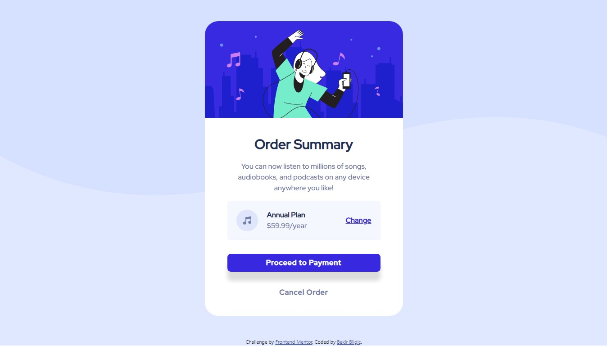

# Frontend Mentor - Order summary card solution

This is a solution to the [Order summary card challenge on Frontend Mentor](https://www.frontendmentor.io/challenges/order-summary-component-QlPmajDUj).

## Table of contents

 - [The challenge](#the-challenge)
 - [Screenshot](#screenshot)
 - [Built with](#built-with)
 - [Continued development](#continued-development)

**Note: Delete this note and update the table of contents based on what sections you keep.**

### The challenge

Users should be able to:

- See hover states for interactive elements

### Screenshot

### Built with

- Semantic HTML5 markup
- CSS custom properties
- Flexbox

### Continued development

Bootstrap, JavaScript, React
